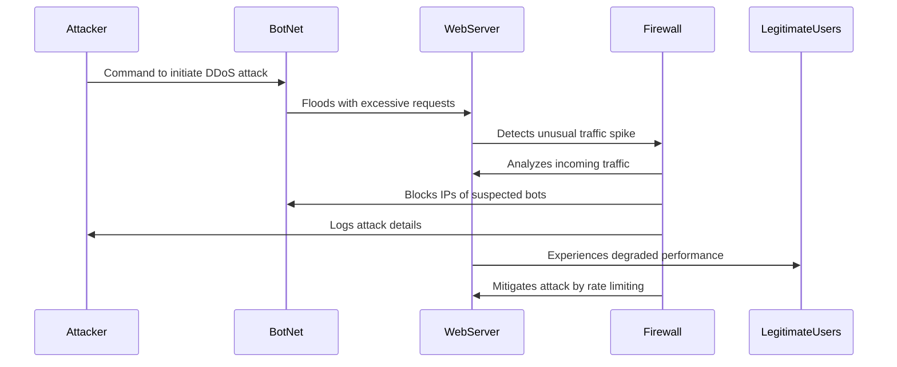

# DDoS Attack Sequence Diagram

This document outlines a **sequence diagram** for a **Distributed Denial of Service (DDoS) attack**, detailing interactions between the attacker, the botnet, the targeted web server, and the firewall (defensive mechanism).

## Sequence Diagram

## Explanation
### Attack Initiation:
- The **Attacker** sends a command to a network of compromised systems (BotNet) to launch a DDoS attack.
- The **BotNet** floods the **WebServer** with an overwhelming number of requests.

### Attack Detection:
- The **WebServer** experiences a surge in traffic and notifies the **Firewall**.
- The **Firewall** begins analyzing the traffic to differentiate legitimate users from malicious requests.

### Defense Mechanisms:
- The **Firewall** identifies attack signatures and blocks IPs associated with the BotNet.
- The **Firewall** logs information about the attack, potentially alerting security teams.
- Rate limiting mechanisms are deployed to minimize the impact on **Legitimate Users**.

### Outcome:
- The **WebServer** performance may still be affected, but legitimate users regain access as the attack is mitigated.
- The **Firewall** continues monitoring for further attack attempts.

This sequence diagram provides a structured overview of the key interactions in a typical **DDoS attack scenario** and how defensive measures respond dynamically.
